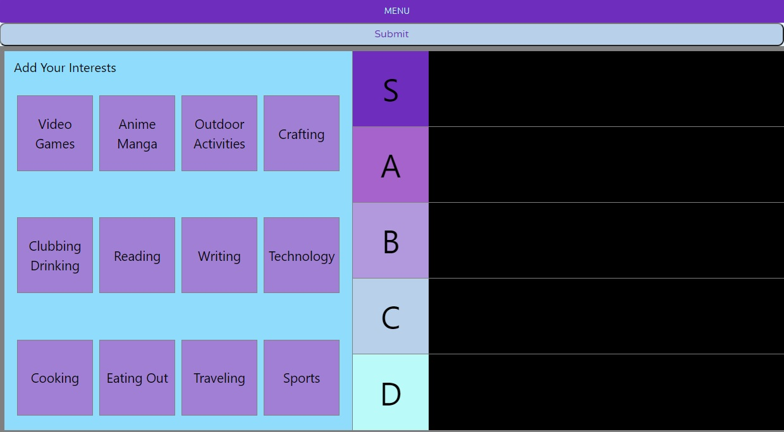

# Know More Tiers
## Description:

---
As an adult, have you ever had trouble trying to find new friends?
Trying to find people with similar hobbies and interests to yourself?
Do you like to make Tierlist’s of your favorite hobbies?
Are you looking for a website that's like a dating website but for friends?
Then we have the website for you!

In a fast paced each changing and evolving world of social networking, dating, food ordering apps, it's rare for people to connect strictly through common interests. Know More Tiers intends to fill that space, by allowing its members to make a tier list for their activities, by rating them from S (super) all the way down to D (below average). After users have selected activities and rated them, they are then matched with other users based on matching interests. 

## [Know More Tiers](https://know-more-tiers.herokuapp.com/)
### https://github.com/Myuze/know-more-tiers
---

## Table of Contents:

---
1. [Installation Instructions](#installation-instructions)
2. [Usage](#usage)
3. [Contribute](#contribute)
4. [Licenses](#licenses)
5. [Questions](#questions)

## Installation Instructions:

---
1. Install, `node.js`.
2. Clone the application repository.
3. In the repository root, in the CLI, `npm install`.

## Usage:

---
From the base repository directory:
1. From the CLI use, `npm run develop`.
2. Open the page at `localhost:3000`.

## Contribute:

---
- If you would like to contribute you can contact me on Github or by Email.

## Licenses:

---

**MIT License**
Copyright &#169; 2021

## Questions:

---

### What is your Github username?

[Myuze](https://github.com/Myuze)

### If you have any other questions, you can reach me at:

[flmeneses.dev@gmail.com](mailto:flmeneses.dev@gmail.com)
